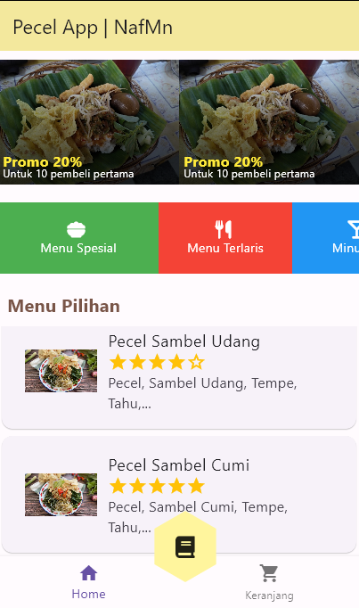
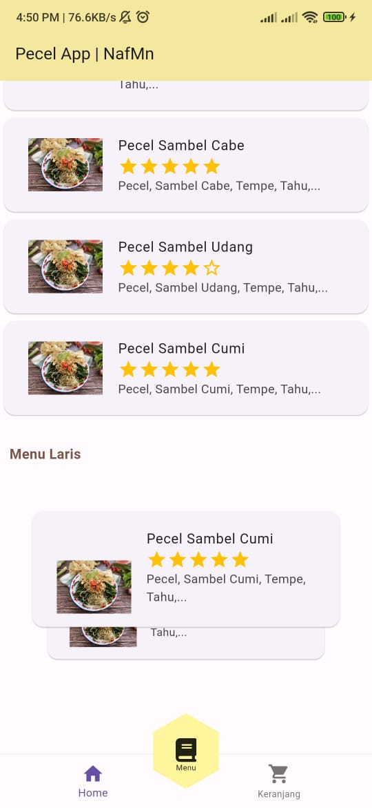

# Pecel_App

Flutter project.

## Dependencies
- cupertino_icons: ^1.0.6
- font_awesome_flutter: ^10.5.0
- flutter_card_swiper: ^7.0.1
- flutter_polygon_clipper: ^1.0.4

## Getting Started

This project is a starting point for a Flutter application.

### Ketentuan 
- Gunakan penyusunan secara Stack dibagian PecelHeader
- Gunakan SingleChildScrollView dibagian Menu bisa scroll kebawah
- Gunakan ListView dan bisa di scroll ke kanan kiri di bagian tagmenu

## View
- 1

- 2

## Contrib
- Nafis
- Beta

## Untuk Memenuhi UAS PAPB
- Bapak Saiful Nur Budiman, S.Kom., M.Kom
